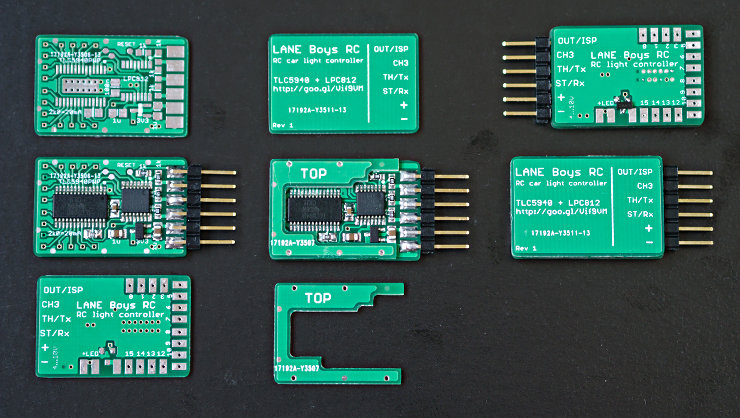

# Light controller for Radio Controlled cars

Realistic lighting of RC model cars using a standard 3-channel radio control system.

The following functions have been implemented:

- **Parking, Low-beam, High-beam** can be switched on/off manually using the AUX (CH3) channel

- **Brake and Reversing lights are automatically** controlled by monitoring the throttle channel. Brake lights automatically turn on for a short, random time when the throttle goes to neutral.

- It is possible to have **combined tail and brake light function** using a single LED through controlling the brightness of the LED.

- **Indicators only come on when you want to**. You have to stay in neutral for one seconds, then hold the steering left/right for one second before they engage. This way normal driving does not trigger the indicators.

- Flashing **hazard lights** can be switched on/off using AUX/CH3

- **Programmable servo output** designed to drive a **steering wheel** or a figures head, or a 2-speed, 3-speed **gearbox**

- Automatic centre and end-point adjustment for all channels

- **16 LEDs** can be driven by one light controller. Two controllers can be **daisy-chained for a maximum of 32 LEDs**.

- High current **switched output** of up to 2A to drive a roof **light bar**

- Light Programs for **custom light animations** like police lights, running lights ...

- Simulation of incandescent lights and faulty ground wiring

- **Pre-processor** for easier wiring

- Up to 3 AUX channels when using the new 5-channel Pre-processor

- All functions can be **customized through a [web browser](https://laneboysrc.github.io/rc-light-controller/)**

## Documentation

An **introduction video** can be found at:

- [https://youtu.be/-VyNAVU3-ok](https://youtu.be/-VyNAVU3-ok)

You may also want to read the **[users guide](doc/light-controller-instructions-mk4-tlc5940-lpc812.pdf)** to get a grasp of the full functionality of this light controller system.

## Hardware

Firmware and schematics for the different variants are included in this project, please consult the sub-folders of the respective variant.

[The current MK4 variant](mk4-tlc5940-lpc812/) can drive **16 LEDs** with a **constant current**. It utilises an inexpensive **NXP ARM Cortex-M0 32-bit microcontroller**.
The main advantage of this design is that it can be fully configured through a [web-based user interface](https://laneboysrc.github.io/rc-light-controller/). Firmware and configuration can be downloaded with a standard USB-to-serial converter, no proprietary tools required.

Through the time the light controller went through several iterations.
A detailed pro- and con- description of each variant can be found in the [hardware overview](doc/hardware-overview.md) document.

## Unable to build one yourself?

Not everyone is able to build circuit boards with tiny SMD components. If this applies to you please contact [laneboysrc@gmail.com](mailto:laneboysrc@gmail.com), we usually have a few fully built-up units in stock.

## Related articles

- [http://laneboysrc.blogspot.com/2012/07/diy-car-light-controller-for-3-channel.html](http://laneboysrc.blogspot.com/2012/07/diy-car-light-controller-for-3-channel.html)

- [http://laneboysrc.blogspot.com/2013/09/diy-rc-light-controller-update.html](http://laneboysrc.blogspot.com/2013/09/diy-rc-light-controller-update.html)

- [http://laneboysrc.blogspot.com/2012/12/pre-processor-for-diy-rc-light.html](http://laneboysrc.blogspot.com/2012/12/pre-processor-for-diy-rc-light.html)

- [http://laneboysrc.blogspot.com/2013/01/pre-processor-miniaturization.html](http://laneboysrc.blogspot.com/2013/01/pre-processor-miniaturization.html)

- [http://laneboysrc.blogspot.com/2014/07/ws2812-and-pl9823-led-power-consumption.html](http://laneboysrc.blogspot.com/2014/07/ws2812-and-pl9823-led-power-consumption.html)

- [http://laneboysrc.blogspot.com/2014/08/diy-rc-light-controller-with-ws2812b.html](http://laneboysrc.blogspot.com/2014/08/diy-rc-light-controller-with-ws2812b.html)
