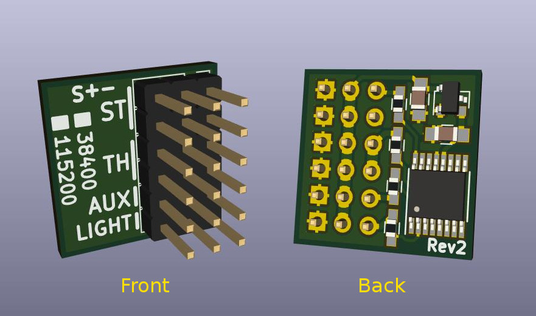

# Pre-processor

The pre-processor converts steering, throttle and AUX/CH3 signals into a single wire serial signal. By mounting the pre-processor near the receiver in the car chassis, you only need to run a standard servo extension cable to the light controller in the body shell.

This makes it very convenient when removing the body shell from the chassis: only one cable needs to be unplugged.

The pre-processor PCB also acts as "Y-cable" for steering and throttle. Use short male-to-male servo extensions to connect the pre-processor to your receiver, and plug the servo and ESC into the two extra ports on the pre-processor.

A [wiring diagram](pre-processor-wiring-diagram.pdf) explains how to connect the pre-processor, the light controller and the other electronics components in an RC car together.

The firmware for the pre-processor is the same as for the [MK4 variant](../mk4-tlc5940-lpc812/), you just have to utilize the MK4 configurator tool to generate a pre-processor firmware.

If the baud rate is configured to 38400, the pre-processor is also compatible with the MK2 and MK3 variants.

The PCB and schematics design was done in [KiCad EDA](http://kicad-pcb.org/)
