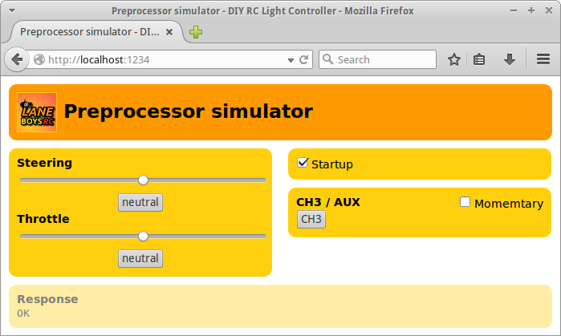

# Tools that apply to multiple versions of the light controller

The command line tools are writing in [Python](http://www.python.org/).

## preprocessor-reader.py

Reads and displays the output of the preprocessor (= a small microcontroller that is designed to be embedded in your receiver. This microcontroller outputs a single serial signal containing information for steering, servo and AUX channels. By using a preprocessor the light controller can be connected with a single servo extension wire.)

Used for debugging and testing the preprocessor.

**NOTE:** Modify the source code for baudrates other than 38400 BAUD.

## preprocessor-simulator.py

This tool simulates an RC transmitter, generating a serial output of steering, throttle and AUX channels in the serial preprocessor format. It is very useful for bench-testing the light controller functionality without having to hook up a RC system.

The user interface is web-based: after launching the tool open your webbrowser and browse to [http://localhost:1234/](http://localhost:1234/)

Keyboard shortcuts:

- **s**: Toggles startup-mode
  Startup-mode signals the light controller that the preprocessor is initializing and not ready for operation yet.

- **c**: Perform a CH3/AUX "click". Easier than hitting the on-screen button with the mouse.

## test-slave.py

This tool drives a light contoller *slave* with a test pattern. Useful for testing.
